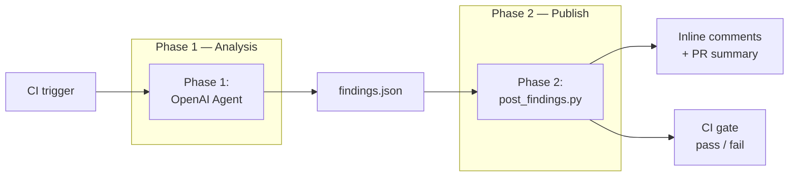
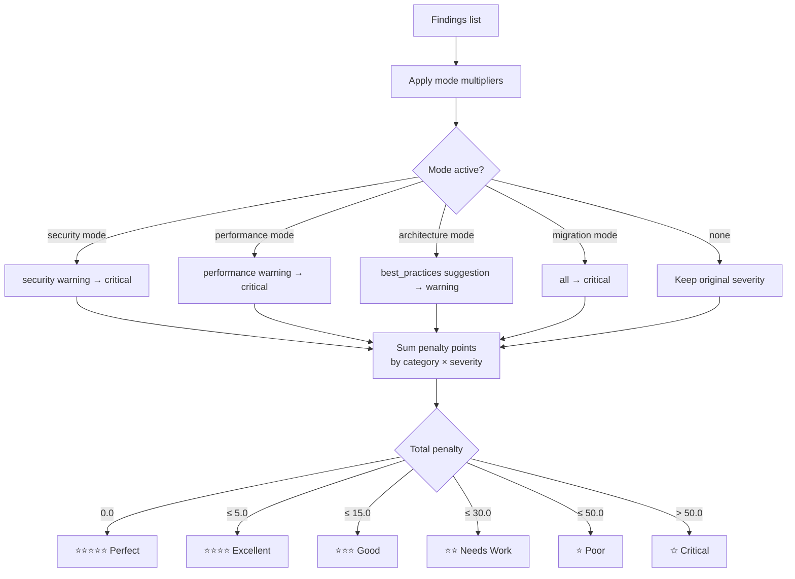
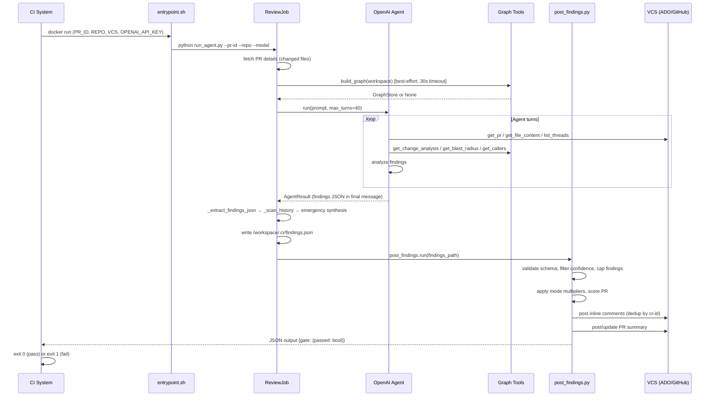

# CodeHawk

An AI-powered pull request review pipeline that runs in CI, produces structured findings, scores code quality, and posts inline comments to Azure DevOps or GitHub — automatically.

---

## How It Works

CodeHawk operates in two phases for every PR review:



**Phase 1** — An OpenAI agent reads the PR diff, fetches changed files, optionally performs AST-based graph analysis, and writes `/workspace/.cr/findings.json`.

**Phase 2** — `post_findings.py` validates the findings file, filters by confidence, caps findings per file, scores the PR using a penalty matrix, posts inline comments to the VCS, and outputs a structured JSON result for CI gating.

---

## Features

### Core Pipeline
- Two-phase architecture: agent analysis → structured publish
- Supports Azure DevOps and GitHub
- Docker-first: runs in any CI that can execute a container
- Model-agnostic: works with `o3`, `gpt-4.1`, `gpt-4o`, `claude-sonnet-4`, `gemini-2.5-pro`, and more

### Reliability & Cost Control
- Turn budget enforcement with deadline injection at `max_turns - 3`
- Three-tier findings extraction fallback (primary → history scan → emergency synthesis)
- Findings capped at 30 total, 5 per file
- Confidence filtering: findings below 0.7 are dropped before posting
- Cost estimation per run using `MODEL_COST_TABLE`

### Integration
- Deduplication: already-posted `cr-id` comments are skipped on re-push
- Fix verification: re-push automatically checks whether prior findings are fixed/still-present
- `.codereview.yml` gate: configurable `min_star_rating` and `fail_on_critical`
- CI exit code: non-zero when gate fails

### Developer Controls
- `# cr: intentional` — suppress a specific line finding
- `# cr: ignore-next-line` — suppress the following line
- `# cr: ignore-block start` / `# cr: ignore-block end` — suppress a block
- `.codereview.md` — per-repo coding conventions injected into the agent prompt
- `DRY_RUN=true` — score and print without posting to VCS

---

## Quick Start

### Docker — Azure DevOps

```bash
docker run --rm \
  -e PR_ID=42 \
  -e REPO=MyRepo \
  -e VCS=ado \
  -e OPENAI_API_KEY=sk-... \
  -e AZURE_DEVOPS_ORG=my-org \
  -e AZURE_DEVOPS_PROJECT=my-project \
  -e AZURE_DEVOPS_PAT=... \
  -v /workspace:/workspace \
  codehawk
```

### Docker — GitHub

```bash
docker run --rm \
  -e PR_ID=42 \
  -e REPO=owner/repo \
  -e VCS=github \
  -e OPENAI_API_KEY=sk-... \
  -e GH_TOKEN=ghp_... \
  -v /workspace:/workspace \
  codehawk
```

### Python CLI

```bash
python src/run_agent.py \
  --pr-id 42 \
  --repo MyRepo \
  --workspace /workspace \
  --model o3 \
  --max-turns 40 \
  --prompt-file commands/review-pr-core.md
```

---

## Environment Variables

### Required

| Variable | Description |
|----------|-------------|
| `PR_ID` | Pull request number |
| `REPO` | Repository name or `owner/repo` |
| `VCS` | `ado` or `github` |
| `OPENAI_API_KEY` | OpenAI API key |

### Optional

| Variable | Default | Description |
|----------|---------|-------------|
| `OPENAI_MODEL` | `o3` | Model to use for the review agent |
| `MAX_TURNS` | `40` | Maximum agent turns before deadline injection |
| `DRY_RUN` | _(unset)_ | Set to any value to skip VCS writes |
| `COMMIT_ID` | _(unset)_ | Source commit SHA (required for GitHub inline comments) |
| `LOG_LEVEL` | `INFO` | Logging verbosity: `DEBUG`, `INFO`, `WARNING`, `ERROR` |
| `LOG_FORMAT` | `json` | Log format: `json` or `text` |
| `ENABLE_GRAPH` | `true` | Enable AST-based graph analysis (`code-review-graph` package) |
| `ENABLE_PR_SCORING` | `true` | Enable penalty-based PR scoring |
| `MIN_CONFIDENCE_SCORE` | `0.7` | Minimum confidence to post a finding |
| `MAX_COMMENTS_PER_FILE` | `5` | Maximum inline comments per file |
| `UPDATE_EXISTING_SUMMARY` | `true` | Update existing summary comment instead of creating a new one |

### ADO-specific

| Variable | Description |
|----------|-------------|
| `AZURE_DEVOPS_ORG` | Azure DevOps organization name |
| `AZURE_DEVOPS_PROJECT` | Azure DevOps project name |
| `AZURE_DEVOPS_PAT` | Personal Access Token |
| `AZURE_DEVOPS_SYSTEM_TOKEN` | System Access Token (from `$(System.AccessToken)` in pipelines) |
| `AZURE_DEVOPS_REPO` | Repository name (overrides `REPO` for ADO) |
| `AUTH_MODE` | `auto` (default), `pat`, or `system_token` |

### GitHub-specific

| Variable | Description |
|----------|-------------|
| `GH_TOKEN` | GitHub personal access token or `GITHUB_TOKEN` from Actions |

---

## Configuration

### `.codereview.yml` — Gate Thresholds

Place in the repository root (or workspace root) to control CI gate behavior:

```yaml
# Minimum star rating to pass the gate (1–5, default: 0 = disabled)
min_star_rating: 3

# Fail the build if any critical findings are present (default: true)
fail_on_critical: true
```

### `.codereview.md` — Review Conventions

Place in the repository root to inject project-specific review guidance into the agent prompt:

```markdown
# Review Conventions

Languages: Python 3.11, FastAPI
Frameworks: SQLAlchemy, Pydantic v2

## Focus Areas
- Always check SQL queries for injection risks
- Validate all user inputs at API boundaries
- No raw string concatenation in auth paths
```

---

## Findings Schema

The agent writes `/workspace/.cr/findings.json` at the end of Phase 1. Phase 2 reads it.

### Example

```json
{
  "pr_id": 42,
  "repo": "MyRepo",
  "vcs": "ado",
  "review_modes": ["standard", "security"],
  "tool_calls": 18,
  "agent": "openai-api",
  "findings": [
    {
      "id": "cr-001",
      "file": "src/auth/login.py",
      "line": 42,
      "severity": "critical",
      "category": "security",
      "title": "SQL injection via unsanitized user input",
      "message": "The username parameter is interpolated directly into the SQL query string.",
      "confidence": 0.95,
      "suggestion": "Use parameterized queries: cursor.execute('SELECT * FROM users WHERE username = %s', (username,))"
    }
  ],
  "fix_verifications": [
    {
      "cr_id": "cr-001",
      "status": "fixed",
      "reason": "Line 42 now uses cursor.execute with parameterized query."
    }
  ],
  "usage": {
    "input_tokens": 45000,
    "output_tokens": 3200,
    "total_tokens": 48200,
    "model": "o3",
    "duration_seconds": 142.3
  }
}
```

### Finding Fields

| Field | Type | Required | Description |
|-------|------|----------|-------------|
| `id` | string | yes | Unique ID matching `cr-NNN` (e.g., `cr-001`) |
| `file` | string | yes | File path relative to repo root |
| `line` | integer | yes | Line number of the finding (min: 1) |
| `severity` | string | yes | `critical`, `warning`, or `suggestion` |
| `category` | string | yes | `security`, `performance`, `best_practices`, `code_style`, `documentation` |
| `title` | string | yes | One-line summary |
| `message` | string | yes | Full description of the issue |
| `confidence` | float | yes | 0.0–1.0 — findings below 0.7 are filtered out |
| `suggestion` | string/null | yes | Concrete fix suggestion (may be null) |

### FixVerification Fields

| Field | Type | Description |
|-------|------|-------------|
| `cr_id` | string | Matches a prior `Finding.id` |
| `status` | string | `fixed`, `still_present`, or `not_relevant` |
| `reason` | string | One-sentence explanation of the classification |

---

## Review Modes

The agent auto-detects review modes from file paths and PR labels. Modes affect which checklist is applied and how penalties are weighted.

| Mode | File Path Signal | Label Signal | Scoring Effect |
|------|-----------------|--------------|----------------|
| `standard` | (default) | — | Base penalty matrix |
| `security` | `**/auth/**`, `**/crypto/**`, `**/permissions/**` | `security` | Security warnings elevated to critical (×2 penalty) |
| `performance` | `**/queries/**`, `**/cache/**`, `**/indexes/**` | `performance` | Performance warnings elevated to critical (×2 penalty) |
| `architecture` | `**/api/**`, `**/interfaces/**`, >10 files changed | `architecture` | Best-practices suggestions elevated to warnings (×1.5 penalty) |
| `migration` | `**/migrations/**`, `*.sql`, `**/alembic/**` | `migration`, `db-change` | All findings treated as critical for gating |
| `docs_chore` | All changed files are docs/config only | `docs`, `chore` | Light-touch review, max 10 findings |

Multiple modes may be active simultaneously (e.g., a PR touching auth and migrations → `["security", "migration"]`).

---

## Scoring System

CodeHawk uses a penalty-based scoring system — **lower is better**. Findings accumulate penalty points by category and severity. The total determines the star rating.

### Default Penalty Matrix

| Category | Critical | Warning | Suggestion |
|----------|----------|---------|------------|
| Security | 5.0 | 4.0 | 2.0 |
| Performance | 3.0 | 2.0 | 1.0 |
| Best Practices | 2.0 | 1.0 | 0.5 |
| Code Style | 0.0 | 0.0 | 0.0 |
| Documentation | 0.0 | 0.0 | 0.0 |

### Star Rating Thresholds

| Stars | Penalty Points | Quality Level |
|-------|---------------|---------------|
| ⭐⭐⭐⭐⭐ | 0.0 | Perfect |
| ⭐⭐⭐⭐ | ≤ 5.0 | Excellent |
| ⭐⭐⭐ | ≤ 15.0 | Good |
| ⭐⭐ | ≤ 30.0 | Needs Work |
| ⭐ | ≤ 50.0 | Poor |
| ☆☆☆☆☆ | > 50.0 | Critical |



All penalty thresholds and per-category values are configurable via environment variables (e.g., `PENALTY_SECURITY_CRITICAL`, `PENALTY_THRESHOLD_4_STARS`).

---

## Pipeline Flow



---

## Cost Tracking

CodeHawk estimates review cost from token usage in the findings `usage` block. The `MODEL_COST_TABLE` maps model names to per-million-token rates (input, output) in USD.

| Model | Input ($/1M tokens) | Output ($/1M tokens) |
|-------|--------------------|--------------------|
| `o3` | $2.00 | $8.00 |
| `gpt-4.1` | $2.00 | $8.00 |
| `gpt-4.1-mini` | $0.40 | $1.60 |
| `gpt-4o` | $2.50 | $10.00 |
| `gpt-4o-mini` | $0.15 | $0.60 |
| `o4-mini` | $1.10 | $4.40 |
| `claude-opus-4` | $15.00 | $75.00 |
| `claude-sonnet-4` | $3.00 | $15.00 |
| `claude-haiku-3.5` | $0.80 | $4.00 |
| `gemini-2.5-pro` | $1.25 | $10.00 |
| `gemini-2.5-flash` | $0.15 | $0.60 |
| `gemini-2.0-flash` | $0.10 | $0.40 |

Cost is estimated and surfaced in the PR summary and the Phase 2 JSON output (`cost_estimate.total_cost_usd`).

---

## Project Structure

```
codehawk/
├── src/
│   ├── run_agent.py          # CLI entry point — parses args, builds ReviewJob, runs pipeline
│   ├── review_job.py         # ReviewJob — orchestrates Phase 1 + Phase 2
│   ├── post_findings.py      # Phase 2 engine — filter, score, post, gate
│   ├── pr_scorer.py          # Penalty-based PR scorer
│   ├── graph_builder.py      # Best-effort AST graph builder (code-review-graph)
│   ├── config.py             # Pydantic settings — all env vars with validation
│   ├── score_comparison.py   # Before/after score comparison for fix verification
│   ├── agents/
│   │   └── openai_runner.py  # OpenAI agent runner (Chat Completions + Responses API)
│   ├── tools/
│   │   ├── registry.py       # ToolRegistry — register, dispatch, openai/responses definitions
│   │   ├── graph_tools.py    # Graph tools: get_change_analysis, get_blast_radius, get_callers, get_dependents
│   │   ├── vcs_tools.py      # VCS tools: get_pr, get_file_content, list_threads
│   │   └── workspace_tools.py# Workspace tools: read_local_file, search_code, git_blame
│   ├── activities/           # VCS activity classes (ADO + GitHub)
│   └── models/               # Pydantic/dataclass models: Finding, PRScore, FindingsFile
├── commands/
│   ├── review-pr-core.md     # Agent instruction set (Steps 1–7)
│   └── findings-schema.json  # JSON Schema for findings.json
├── docs/
│   ├── README.md             # Documentation index
│   ├── architecture.md       # Architecture deep-dive
│   └── features/             # Feature-specific documentation
├── ci/                       # CI pipeline templates (ADO + GitHub Actions)
├── templates/                # Repository configuration templates
├── entrypoint.sh             # Docker entrypoint — validates env, runs pipeline
├── Dockerfile                # Container image definition
└── pyproject.toml            # Project metadata and tool configuration
```

---

## Development Setup

```bash
# Clone
git clone https://github.com/dsiddharth2/codehawk.git
cd codehawk

# Create virtual environment
python -m venv .venv
source .venv/bin/activate  # Windows: .venv\Scripts\activate

# Install dependencies
pip install -r requirements.txt
pip install -r requirements-dev.txt

# Run tests
pytest tests/

# Build Docker image
docker build -t codehawk .

# Dry run (no VCS writes)
DRY_RUN=true python src/run_agent.py \
  --pr-id 1 --repo MyRepo --workspace /workspace \
  --model o3 --max-turns 40 \
  --prompt-file commands/review-pr-core.md
```

---

## Documentation

| Document | Description |
|----------|-------------|
| [Architecture](docs/architecture.md) | System design, component interactions, data flow |
| [Agent Runner](docs/features/agent-runner.md) | OpenAI agent runner internals, turn budget, findings extraction |
| [Graph Tools](docs/features/graph-tools.md) | AST-based graph analysis: change analysis, blast radius, callers |
| [Review Modes](docs/features/review-modes.md) | Mode detection, checklists, and severity multipliers |
| [Scoring](docs/features/scoring.md) | Penalty matrix, star ratings, and configuration |
| [Post Findings](docs/features/post-findings.md) | Phase 2: filtering, capping, dedup, summary generation |
| [Fix Verification](docs/features/fix-verification.md) | Re-push detection and fix classification |
| [CI Integration](docs/features/ci-integration.md) | ADO and GitHub Actions pipeline setup |
| [VCS CLI](docs/features/vcs-cli.md) | VCS command wrappers for ADO and GitHub |

---

## License

MIT
