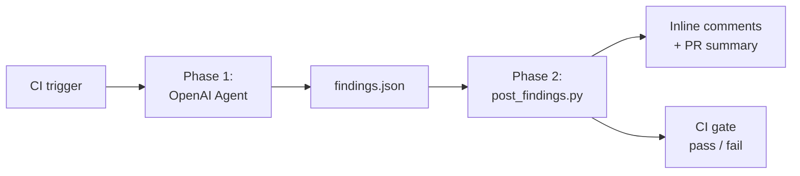

# CodeHawk

[](https://github.com/dsiddharth2/codehawk/actions/workflows/ci.yml)
[](https://github.com/dsiddharth2/codehawk/actions/workflows/publish-docker.yml)
[](https://hub.docker.com/r/dsiddharth2/codehawk)
[](https://hub.docker.com/r/dsiddharth2/codehawk)
[](LICENSE)
[](https://www.python.org/downloads/)

AI-powered pull request review pipeline that runs in CI, produces structured findings, scores code quality, and posts inline comments to Azure DevOps or GitHub.

---

## How It Works


```mermaid
flowchart LR
    A[CI trigger] --> B[Phase 1:\nOpenAI Agent]
    B --> C[findings.json]
    C --> D[Phase 2:\npost_findings.py]
    D --> E[Inline comments\n+ PR summary]
    D --> F[CI gate\npass / fail]
```

**Phase 1** — An OpenAI agent reads the PR diff, fetches changed files, optionally performs AST-based graph analysis, and writes `findings.json`.

**Phase 2** — `post_findings.py` validates findings, filters by confidence, scores the PR using a penalty matrix, posts inline comments, and outputs a structured result for CI gating.

---

## Quick Start

### Docker (Azure DevOps)

```bash
docker run --rm \
  -e PR_ID=42 \
  -e REPO=MyRepo \
  -e VCS=ado \
  -e OPENAI_API_KEY=sk-... \
  -e AZURE_DEVOPS_ORG=my-org \
  -e AZURE_DEVOPS_PROJECT=my-project \
  -e AZURE_DEVOPS_PAT=... \
  -v /workspace:/workspace \
  dsiddharth2/codehawk
```

### Docker (GitHub)

```bash
docker run --rm \
  -e PR_ID=42 \
  -e REPO=owner/repo \
  -e VCS=github \
  -e OPENAI_API_KEY=sk-... \
  -e GH_TOKEN=ghp_... \
  -v /workspace:/workspace \
  dsiddharth2/codehawk
```

### Python CLI

```bash
python src/run_agent.py \
  --pr-id 42 --repo MyRepo --workspace /workspace \
  --model o3 --max-turns 40 --prompt-file commands/review-pr-core.md
```

---

## Key Features

- **Two-phase architecture** — agent analysis is separated from deterministic posting
- **Azure DevOps + GitHub** — inline comments, PR summaries, thread resolution
- **Model-agnostic** — works with `o3`, `gpt-4.1`, `gpt-4o`, `claude-sonnet-4`, `gemini-2.5-pro`, and more
- **Fix verification** — re-push detects fixed/dismissed/still-present findings and resolves threads
- **Developer dismissals** — reply to a finding with reasoning; CodeHawk evaluates and accepts or rejects
- **Scoring** — penalty-based star rating (0-5 stars) with mode-aware severity multipliers
- **Cost tracking** — per-run token usage and cost estimation
- **Developer controls** — `# cr: intentional`, `.codereview.md` conventions, `.codereview.yml` gate thresholds
- **Deduplication** — cr-id based; re-runs skip already-posted findings
- **Dry run** — `DRY_RUN=true` scores and prints without posting to VCS

---

## Developer Controls

| Control | Effect |
|---------|--------|
| `# cr: intentional` | Suppress a specific line finding |
| `# cr: ignore-next-line` | Suppress the following line |
| `# cr: ignore-block start/end` | Suppress a block |
| `.codereview.md` | Per-repo conventions injected into the agent prompt |
| `.codereview.yml` | Gate thresholds: `min_star_rating`, `fail_on_critical` |
| `DRY_RUN=true` | Score and print without posting to VCS |

---

## Environment Variables

See [CI Integration docs](docs/features/ci-integration.md) for the full reference. The essentials:

| Variable | Required | Description |
|----------|----------|-------------|
| `PR_ID` | Yes | Pull request number |
| `REPO` | Yes | Repository name or `owner/repo` |
| `VCS` | Yes | `ado` or `github` |
| `OPENAI_API_KEY` | Yes | OpenAI API key |
| `OPENAI_MODEL` | No | Model to use (default: `o3`) |
| `DRY_RUN` | No | Skip VCS writes |

---

## Project Structure

```
codehawk/
├── src/
│   ├── run_agent.py          # CLI entry point
│   ├── review_job.py         # Phase 1 orchestrator
│   ├── post_findings.py      # Phase 2 engine
│   ├── fix_verifier.py       # Per-file fix verification
│   ├── score_comparison.py   # Before/after score comparison
│   ├── config.py             # Pydantic settings
│   ├── agents/               # OpenAI agent runner
│   ├── tools/                # VCS, graph, and workspace tools
│   ├── activities/           # VCS activity classes (ADO + GitHub)
│   └── models/               # Pydantic/dataclass models
├── commands/                 # Agent prompts and JSON schema
├── docs/                     # Full documentation
├── ci/                       # CI pipeline templates
├── Dockerfile
└── pyproject.toml
```

---

## Documentation

Full docs live in [`docs/`](docs/README.md):

| Document | Description |
|----------|-------------|
| [Architecture](docs/architecture.md) | Two-phase design, component interactions, data flow |
| [Agent Runner](docs/features/agent-runner.md) | Agent internals, turn budget, findings extraction |
| [Post Findings](docs/features/post-findings.md) | Phase 2: filtering, scoring, posting, summary |
| [Fix Verification](docs/features/fix-verification.md) | Re-push detection, fix/dismissal classification |
| [Scoring](docs/features/scoring.md) | Penalty matrix, star ratings, configuration |
| [Review Modes](docs/features/review-modes.md) | Mode detection and severity multipliers |
| [CI Integration](docs/features/ci-integration.md) | Pipeline setup, env vars, Docker usage |
| [VCS CLI](docs/features/vcs-cli.md) | VCS command wrappers for ADO and GitHub |

---

## Development

```bash
git clone https://github.com/dsiddharth2/codehawk.git
cd codehawk
python -m venv .venv && .venv\Scripts\activate   # Linux: source .venv/bin/activate
pip install -r requirements.txt -r requirements-dev.txt
pytest tests/
```

---

## License

MIT
