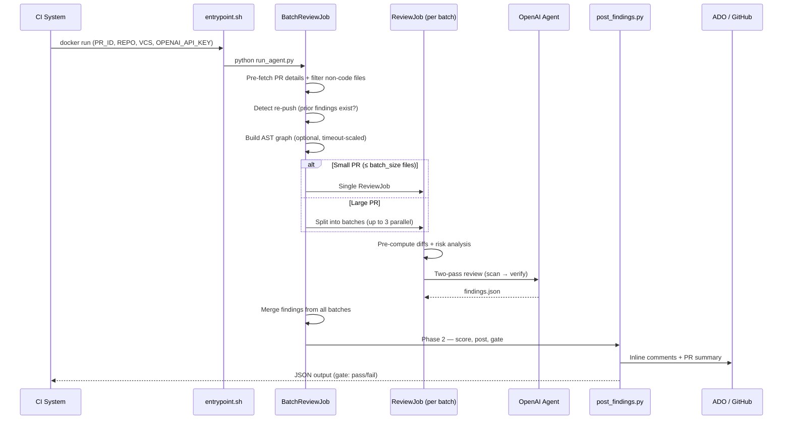

# CodeHawk — Architecture

## Overview

CodeHawk is a Docker-based AI code review system. An LLM agent reviews a PR and writes `findings.json`; a deterministic Python engine then scores, deduplicates, and posts comments to Azure DevOps or GitHub. The two phases are explicitly separated — the agent never touches the VCS posting API, and the poster never touches the LLM.

---

## Pipeline Flow



---

## Two-Phase Architecture

### Phase 1 — Agent Review

The agent runs inside a Docker container with access to the workspace. It reads the PR diff and changed files using registered tools, then writes `/workspace/.cr/findings.json`.

**Key principle:** The agent produces structured data only. It never posts comments or modifies PR state.

### Phase 2 — Deterministic Posting

`post_findings.py` reads `findings.json`, normalizes and validates findings, filters by confidence, caps per file, deduplicates via cr-ids, scores the PR, posts inline comments, resolves fix verification threads, and outputs a structured JSON result for CI gating.

**Key principle:** Phase 2 is fully deterministic. It can be re-run independently, tested without an LLM, and exercised with `--dry-run`.

---

## Batch Orchestration

`BatchReviewJob` is the top-level orchestrator (`src/batch_review_job.py`):

1. **Pre-fetch PR data** once via `FetchPRDetailsActivity`
2. **Filter non-code files** (extensions in `config.skip_extensions`)
3. **Detect re-pushes** — if previous CodeHawk findings exist in PR threads, switch to `VERIFY_FIXES` mode
4. **Build AST graph** (optional, timeout scaled by file count: 30s for ≤10 files up to 600s for 51-100)
5. **Split into batches** — small PRs get a single `ReviewJob`; large PRs are split (default 10 files/batch, up to 3 concurrent via `ThreadPoolExecutor`)
6. **Merge findings** from all batches (dedup by file+line+category)
7. **Publish** via `post_findings.run()` (Phase 2)

### Review Modes

| Mode | Trigger | Effect |
|------|---------|--------|
| `FULL` | Default | Find new issues + verify prior findings |
| `VERIFY_FIXES` | Prior findings detected | Lightweight: only verify prior findings, no new analysis |
| `CHECK_NEW` | Explicit flag | Fresh review, skip prior findings |

---

## Two-Pass Review

When enabled (`two_pass_enabled=True`, default), the agent uses a two-pass approach:

### Pass 1A — Standard Scan
Single-turn API call. Covers correctness, error handling, testing, code style. Returns `candidates[]` and `files_clean[]` as JSON. No tools available.

### Pass 1B — Deep Scan
Single-turn API call. Covers security, performance, architecture. Returns additional `candidates[]`. No tools available.

### Candidate Merge
Candidates from both scans are deduplicated by file+line+category.

### Pass 2 — Verify
Multi-turn agent loop with full tool access (VCS, workspace, graph). The agent verifies each candidate, refines or drops false positives, adds concrete code suggestions. Uses sliding window (last 3 tool exchanges) for the Responses API to control token cost.

**Fallback:** If Pass 2 fails, Pass 1 candidates are used as unverified findings (confidence 0.6-0.75).

---

## Agent Runner

`OpenAIAgentRunner` (`src/agents/openai_runner.py`) supports two OpenAI APIs:

| API | Models | Detection |
|-----|--------|-----------|
| Chat Completions | gpt-4o, gpt-4.1, o3, etc. | Default |
| Responses | gpt-5-codex, codex-mini-latest | Auto-detected by model name |

**Tool registration:** VCS tools, workspace tools, and graph tools (if available) are registered via `ToolRegistry`. The registry provides both Chat Completions and Responses API tool definitions from the same registration.

**Turn budget:** System prompt includes the turn budget. At `max_turns - 3`, a DEADLINE message is injected telling the agent to output findings immediately.

**Sliding window (Responses API):** Keeps the original prompt plus only the last N tool exchanges (`SLIDING_WINDOW_SIZE=3`), reducing per-turn token cost for long sessions.

---

## Tools

### VCS Tools (`src/tools/vcs_tools.py`)
- `get_pr` — PR metadata, file changes, commit SHAs
- `get_file_content` — File content at a specific commit (source/target/HEAD)
- `list_threads` — PR comment threads (filterable by file, status)
- `get_file_diff` — Unified diff between commits (supports line range drill-in)

### Workspace Tools (`src/tools/workspace_tools.py`)
- `read_local_file` — Read file from workspace (uses `git ls-files` for path resolution)
- `search_code` — Ripgrep pattern search (fallback to grep)
- `git_blame` — Blame info for a file

### Graph Tools (`src/tools/graph_tools.py`)
Available only when AST graph is built successfully:
- `get_change_analysis` — Risk score, review priorities, test gaps
- `get_blast_radius` — Files and functions impacted by changes
- `get_callers` — Structural callers of a function
- `get_dependents` — Files importing a module

---

## Risk Classification

`RiskClassifier` (`src/risk_classifier.py`) assigns HIGH/MEDIUM/LOW risk to each changed file using a weighted formula:

| Component | Weight | Signal |
|-----------|--------|--------|
| Lines changed | 0.25 | Normalized to 500 lines |
| Path sensitivity | 0.25 | auth/crypto/permissions → 1.0, tests/docs → 0.0 |
| New file | 0.15 | New files get 1.0 |
| Test coverage gaps | 0.15 | No test coverage → 1.0 |
| Caller count | 0.10 | Impacted functions (from graph) |
| File type | 0.10 | Code extensions → 1.0, markup → 0.0 |

Classification: HIGH (≥0.6), MEDIUM (≥0.3), LOW (<0.3). Risk level determines review depth — HIGH files get full review + verification, LOW files get a diff scan.

---

## Fix Verification

`fix_verifier.py` determines if prior findings were addressed on re-push:

```
For each prior finding:
  ├── File deleted?         → not_relevant
  ├── File unmodified?
  │   ├── Developer replied? → evaluate dismissal (LLM)
  │   │   ├── Valid reason  → dismissed (0 penalty)
  │   │   └── Invalid       → still_present
  │   └── No reply          → still_present
  └── File modified?        → verify with LLM (per-file call)
      ├── Issue resolved    → fixed
      └── Issue remains     → still_present
```

**Deterministic LLM calls:** One call per modified file (all findings for that file batched together). Cap: 15 individual calls, then batch remaining 5-per-call. Default on failure: `still_present`.

### Developer Dismissals

Developers can reply to a CodeHawk comment with a technical reason for disagreement. On the next push:

1. `FetchPRCommentsActivity.get_developer_replies()` extracts non-CodeHawk replies from PR threads
2. `_evaluate_dismissal()` sends the finding + code snippet + developer reply to the LLM
3. If accepted: finding marked `dismissed`, reply posted with explanation + suggested `.codereview.md` rule
4. If rejected: finding remains `still_present`, explanation posted

Accepted dismissals resolve the thread with `WONT_FIX` status (not `FIXED`), distinguishing developer-disputed findings from genuinely fixed ones.

---

## Idempotency via cr-id Deduplication

Every finding gets a stable identifier:

```python
hashlib.sha1(f"{file}:{line}:{category}".encode()).hexdigest()[:8]
```

The agent writes `cr_id: null`; the poster computes the hash and injects `<!-- cr-id: {id} -->` into every posted comment. On re-runs, existing thread markers are extracted and matching findings are skipped. This makes re-runs safe — no duplicate comments.

**Limitation:** cr-id uses the file path. File renames between runs break matching (accepted for v1).

---

## Scoring System

`PRScorer` (`src/pr_scorer.py`) calculates penalty-based quality scores — **lower is better**.

### Penalty Matrix (defaults)

| Category | Critical | Warning | Suggestion |
|----------|----------|---------|------------|
| Security | 5.0 | 4.0 | 2.0 |
| Performance | 3.0 | 2.0 | 1.0 |
| Best Practices | 2.0 | 1.0 | 0.5 |
| Architecture | 3.0 | 2.0 | 1.0 |
| Correctness | 2.0 | 1.0 | 0.5 |
| Error Handling | 1.5 | 0.75 | 0.25 |
| Code Style | 1.0 | 0.5 | 0.25 |
| Testing | 1.5 | 0.75 | 0.25 |

### Mode Multipliers

- **Security mode:** security findings ×2 (warning → critical penalty)
- **Performance mode:** performance findings ×2
- **Architecture mode:** best_practices ×1.5 (suggestion → warning penalty)
- **Migration mode:** all findings elevated to critical

### Star Rating

| Stars | Penalty | Quality |
|-------|---------|---------|
| 5 | 0.0 | Perfect |
| 4 | ≤ 5.0 | Excellent |
| 3 | ≤ 15.0 | Good |
| 2 | ≤ 30.0 | Needs Work |
| 1 | ≤ 50.0 | Poor |
| 0 | > 50.0 | Critical |

All thresholds configurable via environment variables.

---

## Smart Diff Summarization

`smart_diff.py` handles large diffs that would overflow the agent's context:

- **Small diffs** (< `smart_diff_threshold_kb`, default 15KB): passed as raw text
- **Large diffs**: parsed into structured hunk summaries (line ranges, added/removed counts)
- Agent can drill into high-risk hunks via `get_file_diff` with start_line/end_line

---

## Language-Specific Rules

`ReviewJob` detects languages from file extensions and loads rules from `commands/lang-rules/{lang}.md`. Rules are filtered by detected framework version (e.g., ".NET 8+", "Python 3.10+") using `StackDetector` (`src/stack_detector.py`), which reads version files (`package.json`, `.csproj`, `go.mod`, etc.).

---

## Activities Layer

All VCS operations are encapsulated in activity classes (`src/activities/`), inheriting from `BaseActivity[TInput, TOutput]`:

| Activity | Purpose |
|----------|---------|
| `FetchPRDetailsActivity` | PR metadata, file changes, commit SHAs |
| `FetchFileContentActivity` | File content at a commit |
| `FetchFileDiffActivity` | Unified diff between commits |
| `FetchPRCommentsActivity` | PR comment threads (+ developer reply extraction) |
| `PostPRCommentActivity` | Post inline comments |
| `PostFixReplyActivity` | Reply to existing threads (supports FIXED/WONT_FIX status) |
| `UpdateSummaryActivity` | Post/update PR summary comment |

---

## ADO Rendering Considerations

PR comments are rendered as markdown in Azure DevOps, which has specific rendering rules:

- **Work item auto-linking:** `#<number>` is interpreted as a work item reference. All PR ID references use backtick escaping (`` `#42` ``) to prevent this.
- **Code fences:** Must start on their own line. The `**Suggestion:**` label is separated from code fence openings with a newline.

---

## Configuration

`Settings` (`src/config.py`, Pydantic BaseSettings) loads from environment variables:

| Group | Key Settings |
|-------|-------------|
| VCS | `vcs`, `azure_devops_org/project/pat`, `gh_token`, `auth_mode` |
| Review | `min_confidence_score` (0.5), `max_comments_per_file` (5), `update_existing_summary` |
| Graph | `enable_graph`, `skip_extensions` |
| Batching | `batch_size` (10), `batch_max_turns` (10), `coverage_gate_mode` |
| Two-Pass | `two_pass_enabled`, `scan_pass_max_retries`, `verify_pass_max_turns` (7) |
| Scoring | `enable_pr_scoring`, `penalty_*_*` matrix, `penalty_threshold_*_stars` |
| Risk | `risk_high_threshold` (0.6), `risk_medium_threshold` (0.3) |

---

## Docker Container

Base image: `python:3.11`. Key layers:
- System: git, curl, ripgrep
- GitHub CLI (`gh`)
- Python dependencies: `azure-devops`, `pydantic`, `pydantic-settings`, `openai`, `msrest`
- Application: `src/`, `commands/`, `entrypoint.sh`

`PYTHONPATH=/app/src`. `WORKDIR=/workspace`. `entrypoint.sh` validates env vars and runs the pipeline.

---

## Key Design Decisions

| Decision | Chosen Approach | Rationale |
|----------|----------------|-----------|
| Phase separation | Agent writes data, poster reads data | Enables dry-run, re-run, deterministic testing |
| Pre-computation | Diffs + analysis injected into prompt | Reduces tool calls and token waste |
| Two-pass review | Scan (cheap) → Verify (expensive) | Faster for large PRs, filters false positives early |
| Batch parallelism | Up to 3 concurrent ReviewJobs | Keeps wall-clock time manageable for large PRs |
| Penalty scoring | Lower is better, category × severity matrix | Tunable via config without code changes |
| cr-id dedup | Poster computes SHA1 from file:line:category | LLMs can't reliably compute hashes |
| Dismissal defaults | still_present on any failure | Safe default — never auto-accept |
| Graph degradation | Optional; pipeline works without it | Falls back to search_code for callers/dependents |
