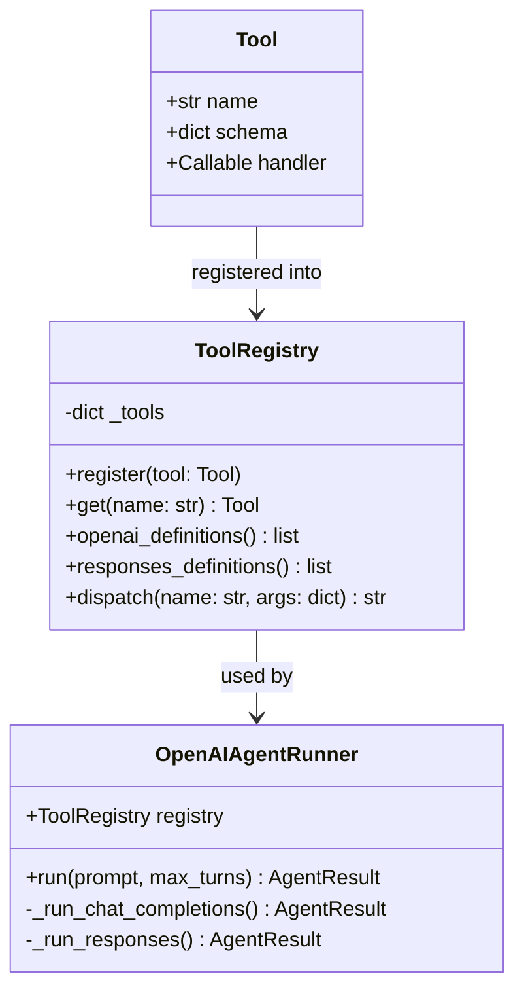
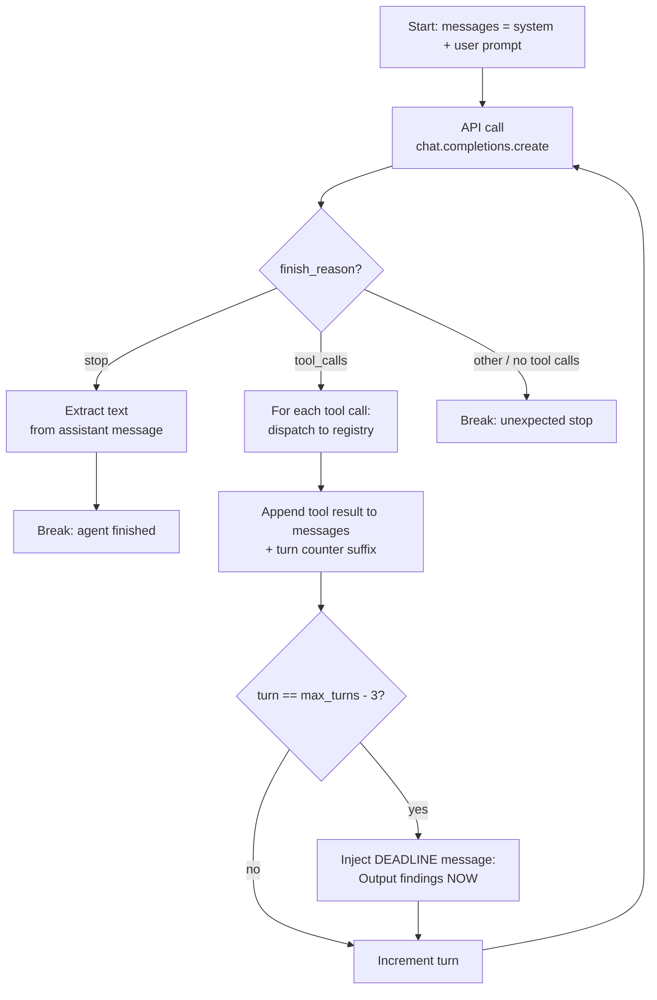
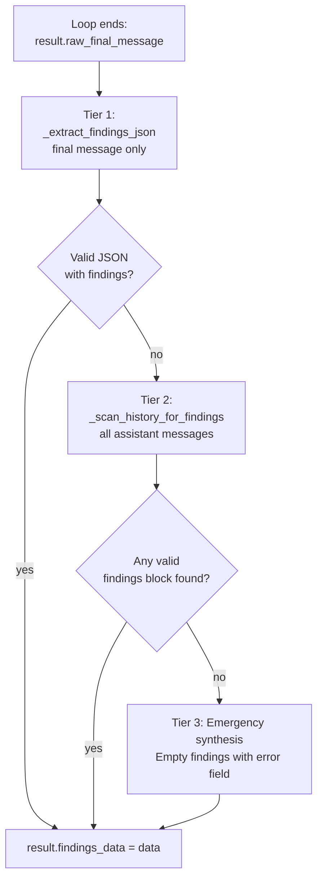

# Agent Runner — OpenAI API Agent

The agent runner (`src/agents/openai_runner.py`) is the Phase 1 engine. It manages the conversation loop with the OpenAI API, dispatches tool calls, enforces the turn budget, and extracts findings from the agent's final output.

---

## Overview — Role in Phase 1

`ReviewJob.create_findings()` builds the agent runner, passes it the review prompt, and collects an `AgentResult`. The runner handles all API communication, tool dispatch, and findings extraction. The job then writes `findings.json` to disk.

```python
runner = OpenAIAgentRunner(
    settings=settings,
    workspace=Path("/workspace"),
    model="o3",
    pr_id=42,
    repo="MyRepo",
    graph_store=graph_store,          # None if graph unavailable
    changed_files=["src/auth.py"],    # pre-fetched from VCS
)
result = runner.run(prompt, max_turns=40)
# result.findings_data  → dict ready for findings.json
```

---

## API Detection

The runner auto-selects the API based on the model name.

| Model(s) | API Used | Set |
|----------|----------|-----|
| `gpt-5-codex`, `codex-mini-latest` | Responses API | `RESPONSES_API_MODELS` |
| All others (`o3`, `gpt-4.1`, `gpt-4o`, `claude-*`, `gemini-*`, etc.) | Chat Completions API | (default) |

The `RESPONSES_API_MODELS` set is defined at module level in `openai_runner.py`:

```python
RESPONSES_API_MODELS = {"gpt-5-codex", "codex-mini-latest"}
```

The check is:

```python
@property
def _use_responses_api(self) -> bool:
    return self.model in RESPONSES_API_MODELS
```

Both APIs use the same `ToolRegistry` and tool definitions format, but the Responses API uses `responses_definitions()` and maintains state via `previous_response_id`.

---

## Tool System

Tools are registered into a `ToolRegistry` before the agent runs. The registry maps tool names to `Tool` dataclass instances and exposes definitions in both API formats.



### Tool Registration

Tools are registered in `OpenAIAgentRunner.__init__()`:

```python
self.registry = ToolRegistry()
register_vcs_tools(self.registry, settings, pr_id, repo)
register_workspace_tools(self.registry, workspace)
if graph_store is not None:
    register_graph_tools(self.registry, workspace, graph_store, changed_files)
```

Graph tools are only registered when `graph_store` is not `None`.

### `openai_definitions()` vs `responses_definitions()`

| Format | Shape | Used by |
|--------|-------|---------|
| `openai_definitions()` | `[{"type": "function", "function": {"name": ..., ...}}]` | Chat Completions API |
| `responses_definitions()` | `[{"type": "function", "name": ..., "description": ..., "parameters": ...}]` | Responses API |

### Tool Dispatch

```python
tool_result = self.registry.dispatch(fn_name, fn_args)
```

If the tool name is unknown, returns `{"error": "Unknown tool: <name>"}`. If the handler raises, the exception is caught and returned as `{"error": "...", "type": "..."}`.

---

## System Prompt

The system prompt is built dynamically by `build_system_prompt(max_turns, has_graph)`.

**Content:**
- Role statement: "You are a code review agent..."
- Turn budget warning with exact `max_turns` count and reserve-3 instruction
- Graph strategy block (switches based on `has_graph`)
- Tool name mapping table (maps shell commands to tool equivalents)

**Graph / no-graph adaptation:**

| Condition | Strategy injected |
|-----------|------------------|
| `has_graph=True` | Graph-first: first call MUST be `get_change_analysis`, use graph for file prioritization |
| `has_graph=False` | No-graph: use `get_file_diff` for diffs, `search_code` for structural queries |

**Tool mapping table (always included):**

| Shell command | Tool equivalent |
|--------------|----------------|
| `python vcs.py get-pr` | `get_pr` |
| `python vcs.py get-file` | `get_file_content` |
| `python vcs.py list-threads` | `list_threads` |
| `rg <pattern>` | `search_code` |
| `cat /workspace/<file>` | `read_local_file` |
| `git blame <file>` | `git_blame` |
| `git diff` between commits | `get_file_diff` |
| change impact analysis | `get_change_analysis` |
| blast radius | `get_blast_radius` |
| caller lookup | `get_callers` |
| import dependents | `get_dependents` |

---

## Conversation Loop



**Key behaviors:**
- Each tool result has `[Turn N/max_turns used. M remaining.]` appended so the agent always knows its budget
- Tool results exceeding 30,000 characters are truncated with a `... [truncated, too large]` suffix
- At `turn == max_turns - 3`, a DEADLINE message is injected as a user turn before the next API call

---

## Turn Budget Management

Three independent layers prevent the agent from running out of turns without producing output.

### Layer 1: Continuous counter

Every tool call result is annotated with the current turn count and remaining turns. The agent sees this in every response and can self-regulate.

### Layer 2: Deadline injection at `N-3`

At turn `max_turns - 3`, the runner injects this message as a user turn:

```
DEADLINE: You have 3 turns remaining. You MUST output your findings JSON NOW.
Do not make any more tool calls. Produce the ```json findings block immediately
with whatever findings you have collected so far. Partial output is required.
```

This gives the agent 3 turns (typically one API call) to finalize and output findings.

### Layer 3: 30k truncation

Tool results are hard-truncated at 30,000 characters to prevent context overflow on large file reads or search results.

---

## Findings Extraction

After the conversation loop ends, findings are extracted from the agent's output using a three-tier fallback cascade.



### Tier 1: `_extract_findings_json(text)`

Applied to `result.raw_final_message` (the last assistant message).

1. Tries to extract a JSON block from a ` ```json ` code fence via regex
2. Falls back to matching any `{...}` object containing `"pr_id"` via regex
3. Falls back to trying to parse the entire text as JSON
4. Tries again with `strict=False` (allows control characters in strings)

### Tier 2: `_scan_history_for_findings(texts)`

Scans all assistant messages from the conversation.

1. For each message: looks for ` ```json ` fenced blocks containing `"findings"` or `"cr-NNN"`
2. Also extracts brace-balanced `{...}` objects containing `"findings"` key
3. From all candidates, picks the **largest** valid JSON object (prefers most complete output)
4. Searches from last to first (most recent message wins)

### Tier 3: Emergency synthesis

If both tiers fail, produces a minimal valid findings dict:

```python
{
    "pr_id": self.pr_id,
    "repo": self.repo,
    "vcs": "ado",
    "review_modes": ["standard"],
    "findings": [],
    "fix_verifications": [],
    "error": "Agent exhausted turn budget without producing findings"
}
```

This ensures Phase 2 always has a valid (if empty) findings file to process.

---

## AgentResult

`AgentResult` carries all output from a runner execution.

| Field | Type | Description |
|-------|------|-------------|
| `findings_data` | `dict \| None` | Extracted findings JSON (set after extraction cascade) |
| `input_tokens` | `int` | Total input/prompt tokens used across all API calls |
| `output_tokens` | `int` | Total output/completion tokens across all API calls |
| `total_tokens` | `int` | `input_tokens + output_tokens` |
| `tool_calls_count` | `int` | Number of tool calls dispatched |
| `duration_seconds` | `float` | Wall-clock time from start to end of `run()` |
| `model` | `str` | Model name used (set from constructor argument) |
| `turns` | `int` | Number of turns completed |
| `raw_final_message` | `str` | Last assistant message text (used for Tier 1 extraction) |
| `returncode` | `int` | `0` on success, `1` if API errors or no findings extracted |

---

## Usage in ReviewJob

`ReviewJob.create_findings()` shows the full Phase 1 lifecycle:

```python
# src/review_job.py

def create_findings(self) -> Path:
    # 1. Pre-fetch PR data (saves agent turns)
    changed_files = self._fetch_changed_files()

    # 2. Build prompt with changed file table injected
    prompt = self._build_prompt(changed_files=changed_files)

    # 3. Build graph (best-effort, 30s timeout)
    graph_store = build_graph(self.config.workspace)  # None on failure

    # 4. Create and run the agent runner
    runner = OpenAIAgentRunner(
        settings=self.settings,
        workspace=self.config.workspace,
        model=self.config.model,
        pr_id=self.config.pr_id,
        repo=self.config.repo,
        graph_store=graph_store,
        changed_files=[fc.path for fc in changed_files],
    )
    self._agent_result = runner.run(prompt, max_turns=self.config.max_turns)

    # 5. Stamp usage and write findings.json
    self._stamp_usage(self._agent_result)
    self._write_findings(self._agent_result.findings_data)

    return self._findings_path  # /workspace/.cr/findings.json
```

After `create_findings()` returns, `ReviewJob.publish_results()` calls `post_findings.run()` for Phase 2.
