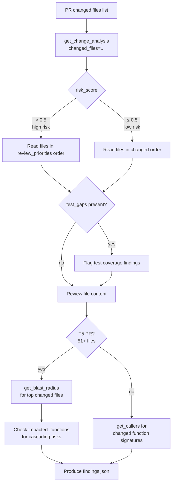

# Graph Tools — AST-Based Structural Analysis

Graph tools provide structural, AST-level analysis of the codebase to help the review agent prioritize high-risk files, understand cascading impact, and find test coverage gaps — without relying on text search.

Graph tools are **optional**. If the `code-review-graph` package is not installed, the workspace is not a git repository, or graph construction times out (30 seconds), the tools are not registered and the agent falls back to diff-based analysis.

---

## Overview

When the graph is available, the agent uses it to:

1. **Prioritize** — `get_change_analysis` scores each changed file by risk and ranks functions to review first
2. **Expand** — `get_blast_radius` finds all files, functions, and tests transitively affected by the changes
3. **Verify callers** — `get_callers` finds every function that directly calls a changed function (no false positives from text search)
4. **Map imports** — `get_dependents` finds every file that imports a changed module

---

## The 4 Graph Tools

### `get_change_analysis`

Analyze changed files for risk score, review priorities, and test coverage gaps.

**When to use:** Call this as the first tool call on every review when graph tools are available. Its output determines which files to read and in what order.

**Input:**

```json
{
  "changed_files": ["src/auth/login.py", "src/models/user.py"]
}
```

**Output:**

```json
{
  "risk_score": 0.65,
  "review_priorities": [
    {"name": "authenticate_user", "file": "src/auth/login.py", "kind": "Function"},
    {"name": "UserModel", "file": "src/models/user.py", "kind": "Class"}
  ],
  "test_gaps": [
    {"name": "authenticate_user", "file": "src/auth/login.py"}
  ]
}
```

**Fields:**

| Field | Description |
|-------|-------------|
| `risk_score` | Float 0.0–1.0. Formula: `min(1.0, non_test_impacted / 20.0)` where `non_test_impacted` is the count of changed + transitively impacted non-test functions/methods |
| `review_priorities` | Functions, methods, and classes in changed files, ranked for review. Read these files first. |
| `test_gaps` | Functions/methods that changed but have no transitive test coverage. Flag missing test coverage in findings. |

**Implementation:** Calls `graph_store.get_impact_radius(changed_files)`, then counts non-test `Function`/`Method` nodes across changed and impacted sets. Calls `graph_store.get_transitive_tests(qualified_name)` for each changed function to detect test gaps.

---

### `get_blast_radius`

Find all files, functions, and tests affected by a set of changed files.

**When to use:** T5 PRs (51+ files changed), or when you suspect a change may cascade into many call sites. Use after `get_change_analysis` for the broadest impact view.

**Input:**

```json
{
  "changed_files": ["src/services/payment.py"]
}
```

**Output:**

```json
{
  "impacted_files": ["src/api/checkout.py", "src/workers/invoice.py"],
  "impacted_functions": [
    {"name": "process_checkout", "file": "src/api/checkout.py", "kind": "Function"},
    {"name": "generate_invoice", "file": "src/workers/invoice.py", "kind": "Method"}
  ],
  "test_gaps": [
    {"name": "generate_invoice", "file": "src/workers/invoice.py"}
  ]
}
```

**Fields:**

| Field | Description |
|-------|-------------|
| `impacted_files` | All files transitively affected by the changed files |
| `impacted_functions` | Function and Method nodes in impacted files |
| `test_gaps` | Impacted functions/methods with no transitive test coverage |

**Implementation:** Calls `graph_store.get_impact_radius(changed_files)`. Extracts `impacted_files` from the result set and filters `impacted_nodes` to `Function`/`Method` kind. Checks transitive test coverage for each impacted non-test node.

---

### `get_callers`

Find all functions that call the specified function using AST CALLS edges.

**When to use:** When a function changed its signature, behavior, or return type. More precise than `search_code` — uses structural graph edges, not text matching, so there are no false positives.

**Input:**

```json
{
  "function_name": "authenticate_user",
  "file_path": "src/auth/login.py"
}
```

**Output:**

```json
{
  "callers": [
    {"name": "login_view", "file": "src/views/auth.py", "line": 34},
    {"name": "api_token_refresh", "file": "src/api/auth.py", "line": 89}
  ]
}
```

**Fields:**

| Field | Description |
|-------|-------------|
| `callers` | List of functions/methods that call the specified function |
| `callers[].name` | Caller function name |
| `callers[].file` | File containing the caller |
| `callers[].line` | Line number of the caller definition |

**Implementation:** Uses `file_path` (if provided) to build a qualified name (`file_path::function_name`) and looks up CALLS edges by target. Also calls `graph_store.search_edges_by_target_name(function_name, kind="CALLS")` for additional matches across the entire graph. Deduplicates by `source_qualified` name.

---

### `get_dependents`

Find all files that import the specified module or file.

**When to use:** When a module's public API, exports, or interface changed. Shows which files will be broken by or affected by the change.

**Input:**

```json
{
  "file_path": "src/models/user.py"
}
```

**Output:**

```json
{
  "dependents": [
    {
      "file": "src/api/users.py",
      "imports": ["src/models/user.py::UserModel", "src/models/user.py::UserRole"]
    },
    {
      "file": "src/auth/login.py",
      "imports": ["src/models/user.py::UserModel"]
    }
  ]
}
```

**Fields:**

| Field | Description |
|-------|-------------|
| `dependents` | Files that import the specified module |
| `dependents[].file` | File path of the importing file |
| `dependents[].imports` | Qualified names of what is imported from the target |

**Implementation:** Strips leading `/` from `file_path`, then calls `graph_store.get_edges_by_target(cleaned)` filtered to `IMPORTS_FROM` edge kind. Falls back to `graph_store.search_edges_by_target_name(cleaned, kind="IMPORTS_FROM")` if no edges found. Groups results by source file.

---

## Graph Builder

The graph is built once per review run before the agent starts.

```python
# src/graph_builder.py
graph_store = build_graph(workspace)   # returns GraphStore or None
```

**Internals:**

| Step | Detail |
|------|--------|
| Package | `code-review-graph` — AST analysis library using SQLite storage |
| Entry point | `code_review_graph.tools.build.build_or_update_graph(full_rebuild=True, repo_root=workspace, postprocess="minimal")` |
| Storage | SQLite database at the path returned by `get_db_path(workspace)` |
| Timeout | 30 seconds via `concurrent.futures.ThreadPoolExecutor` |
| On timeout | Prints warning, returns `None` — pipeline continues without graph |
| Enable flag | `ENABLE_GRAPH=false` (env var) skips build entirely |

**Graceful degradation — all failure modes:**

| Failure | Behavior |
|---------|----------|
| `code-review-graph` not installed | `ImportError` caught, returns `None`, prints skip message |
| Workspace is not a git repo | Exception caught in `_build()`, returns `None` |
| Build times out (>30s) | `TimeoutError` caught, returns `None`, prints timeout message |
| Any other exception | Caught in `_build()`, returns `None` |
| `ENABLE_GRAPH=false` | Returns `None` immediately, no build attempted |
| `GraphStore` is `None` | Graph tools are not registered; agent uses diff-based strategy |

---

## Graph-First Agent Strategy

When graph tools are available, the agent follows this decision flow:



---

## Tier-Based Depth

The agent assigns a tier (T1–T5) based on the number of changed files, then uses graph tools accordingly.

| Tier | Files Changed | Graph Usage | Reading Strategy |
|------|--------------|-------------|-----------------|
| T1 | 1–3 | Optional | Read every file fully |
| T2 | 4–10 | Optional | Read every file fully |
| T3 | 11–25 | `get_change_analysis` for priorities | Read top 15 files, skim remaining via diffs |
| T4 | 26–50 | `get_change_analysis` + `get_callers` | Read top 10 high-risk files; diffs for rest |
| T5 | 51+ | `get_change_analysis` + `get_blast_radius` | Read top 8 files; use `get_blast_radius` for cascade; diffs only for remaining |

---

## Graceful Degradation

When graph tools are unavailable, the system prompt switches to a no-graph strategy:

```
NO GRAPH AVAILABLE — use diffs instead of full file reads:
- Use get_file_diff to review changes without reading entire files.
- Use search_code for structural queries.
```

The agent adapts transparently. All graph tools return `{"error": "..."}` if an exception occurs during execution — the agent is expected to fall back to `search_code` or `read_local_file` on any graph tool error.
